**Des onglets qui dorment, des pages ouvertes en double, un jeu qui rame : ChromeOptimizer s'en occupe, sans ralentir Chrome lui-même.**

[Site](https://chpalitom09-bot.github.io/ChromeOptimizer/) · [Fonctionnalités](#fonctionnalités) · [1PW](#1pw-bêta) · [PULSA](#pulsa) · [BSWP](#bswp) · [EcoOptimizer](#ecooptimizer) · [Versions](#versions) · [Installation](#installation) · [Réglages](#réglages) · [Vie privée](#vie-privée) · [Feuille de route](#feuille-de-route)


> **Statut : version 1.1, en test.** L'extension fonctionne et s'installe à la main (voir plus bas). Elle n'est pas encore sur le Chrome Web Store et les gains de performance n'ont pas encore été mesurés. **1PW**, nouveau dans la 1.1, est en **bêta**.



*Aperçu illustratif : les valeurs affichées sont des exemples.*

## C'est quoi, ChromeOptimizer ?

ChromeOptimizer est un **panneau d'optimisation pour Chrome**. Il repère les onglets que vous n'avez pas touchés depuis longtemps et les met en veille, trouve les pages ouvertes plusieurs fois et n'en garde qu'une, puis vous montre ce que ça a libéré. Quand un onglet doit passer avant tous les autres, **1PW** met le reste en veille d'un clic.

Pas de compte, pas de pub, pas de collecte de données. Tout se passe dans votre navigateur.


## Fonctionnalités



| Et aussi                   | Détail                                                                                                  |
| -------------------------- | ------------------------------------------------------------------------------------------------------- |
| **Panneau d'optimisation** | Liste des onglets avec leur état : actif, inactif, doublon                                              |
| **Optimiser en un clic**   | Ou automatiquement, selon le mode choisi dans les réglages                                              |
| **1PW** *(bêta)*           | Met tous les autres onglets en veille pour concentrer Chrome sur un seul, par exemple un jeu            |
| **PULSA**                  | Un score de réutilisation par onglet à la place d'un délai fixe                                         |
| **BSWP**                   | Charge d'abord ce qui est visible : les images et vidéos très loin sous l'écran attendent               |
| **EcoOptimizer**           | Espace les vérifications et met des fonctions en pause quand la batterie baisse                         |
| **Six langues**            | Français, anglais, espagnol, allemand, chinois et russe                                                 |
| **Mises à jour**           | Une pastille et une bannière préviennent d'une nouvelle version ou d'une correction                     |
| **Délai réglable**         | Mode classique : vous décidez après combien de temps un onglet dort                                     |
| **Sites protégés**         | Une liste de sites que l'extension ne touche jamais                                                     |
| **Raccourcis clavier**     | `Alt + Maj + P` (PULSA), `Alt + Maj + O` (optimiser) et `Alt + Maj + 1` (1PW)                           |
| **Compteurs locaux**       | Onglets mis en veille et doublons fermés, gardés sur votre machine                                      |


## 1PW (bêta)

**1PW** (*One Page Web*) sert quand un onglet doit passer avant les autres : un jeu de navigateur qui rame, par exemple. Vous l'activez depuis cet onglet, et l'extension met **tous les autres en veille** pour libérer de la mémoire et du processeur.



| Principe                              | Ce que ça change                                                                                                         |
| ------------------------------------- | ------------------------------------------------------------------------------------------------------------------------ |
| **Un interrupteur ou un raccourci**   | Cochez **1PW** dans le panneau depuis l'onglet à privilégier, ou appuyez sur `Alt + Maj + 1` (modifiable dans `chrome://extensions/shortcuts`) |
| **Les autres onglets dorment**        | Mise en veille native de Chrome (`chrome.tabs.discard`) : les onglets restent dans la barre et se rechargent au clic     |
| **Les nouveaux onglets aussi**        | Tant que le mode est actif, un onglet ouvert en arrière-plan est endormi dès qu'il a fini de charger                     |
| **Les mêmes protections**             | Onglet visible, onglets épinglés, onglets qui jouent du son, sites protégés et pages internes de Chrome sont épargnés    |
| **Il s'arrête tout seul**             | Quand vous le décochez, ou quand vous fermez l'onglet du jeu. Une pastille verte **1PW** sur l'icône indique qu'il est actif |
| **Fenêtre de l'onglet seulement**     | Une option des réglages laisse éveillés les onglets des autres fenêtres Chrome                                           |

> [!WARNING]
> **1PW est en bêta.** Un onglet en veille perd son état : ce qui n'y a pas été enregistré (un formulaire à moitié rempli, par exemple) est perdu. Chrome ne permet pas de donner plus de puissance à un onglet : 1PW **retire seulement de la charge ailleurs**. Si le ralentissement vient du jeu lui-même ou de la carte graphique, le gain sera faible. **Aucun gain n'est annoncé** à ce stade. 1PW ne lit, ne garde et n'envoie rien, et n'ajoute aucune permission.


## PULSA

**PULSA** (*Predictive Usage Scoring and Lifecycle Algorithm*) remplace le délai fixe par un score. Pour chaque onglet inactif, il estime la probabilité que vous le rouvriez dans l'heure, d'après vos habitudes sur ce site.



| Principe                         | Ce que ça change                                                                                                                                              |
| -------------------------------- | ------------------------------------------------------------------------------------------------------------------------------------------------------------- |
| **Un score, pas un chronomètre** | De 0 à 100. Plus il est bas, moins l'onglet a de chances d'être rouvert. Sous le seuil choisi (prudent, équilibré ou agressif), il est mis en veille          |
| **Il apprend vos habitudes**     | Il retient le temps qui s'écoule d'habitude avant que vous reveniez sur un site : un onglet rouvert toutes les 20 minutes n'est pas traité comme une page lue une fois |
| **Il corrige ses erreurs**       | Si un onglet endormi est rouvert dans l'heure, PULSA devient plus prudent pour ce site                                                                        |
| **Il adapte son seuil**          | Prudent tant que la mémoire est libre, plus ferme quand elle manque (au-delà d'environ 85 % de RAM), et réglé tout seul selon les onglets rouverts trop vite  |
| **Léger**                        | Un calcul simple, sans réseau, et des cycles qui s'espacent (1, 2, 5 puis 10 minutes) quand il n'y a rien à faire                                             |
| **Désactivable**                 | Un réglage permet de revenir au délai fixe, et un bouton efface ce que PULSA a appris                                                                         |

> [!WARNING]
> **PULSA est expérimental.** Il a été comparé à des délais fixes sur des usages **simulés** (20 semaines, 40 onglets), pas encore sur de vrais usages : **aucun gain n'est annoncé** à ce stade. Le banc d'essai valide la mécanique, pas l'efficacité réelle. Méthode et résultats : `bench/` dans les zips PULSA (`node bench/simulate.mjs`).

**Ce que PULSA garde.** Uniquement le **nom de domaine** des sites et des **durées**, sur votre ordinateur. Jamais le contenu des pages ni leur adresse complète, et rien n'est envoyé. La liste des sites visités du panneau est désactivable et effaçable dans les réglages.


## BSWP

**BSWP** (*Better Speed WebPage*) est un petit script qui accélère le chargement des pages en ne chargeant que le nécessaire. Les images, cadres et vidéos situés **loin sous la zone visible** attendent que vous descendiez, et la connexion est libérée pour le haut de la page.



| Principe                                | Ce que ça change                                                                                                           |
| --------------------------------------- | -------------------------------------------------------------------------------------------------------------------------- |
| **Il ne diffère que le lointain**       | Seuls les éléments à plus de deux écrans sous la zone visible sont touchés                                                 |
| **Images et cadres en chargement différé** | Chargement différé natif de Chrome (`loading="lazy"`) et décodage asynchrone                                            |
| **Vidéos : métadonnées seulement**      | Les vidéos sans lecture automatique ne préchargent que leurs métadonnées                                                   |
| **Aucun script bloqué ni retiré**       | Il ne bloque, ne retire et ne reporte aucun script : le risque de casser l'affichage est réduit                            |
| **Éteint par défaut**                   | Il s'active d'un interrupteur dans le panneau. Éteint, il n'est injecté nulle part et l'accès aux sites est retiré         |

> [!WARNING]
> **BSWP est expérimental.** Aucun gain de vitesse n'a encore été mesuré. À l'activation, Chrome vous demande l'accès aux sites, car c'est ce qui permet d'injecter le script. BSWP ne lit, ne garde et n'envoie rien. Rechargez les pages déjà ouvertes après l'avoir activé.


## EcoOptimizer

Sur batterie, **EcoOptimizer** adapte le rythme de l'extension au niveau restant : les cycles de vérification s'espacent par paliers, et quelques fonctions annexes se mettent en pause quand la charge devient critique. Il se règle depuis la page des réglages et reste **éteint par défaut**.



| Batterie | Cycles plus lents de | Fonctions en pause                                                                  |
| -------- | -------------------- | ----------------------------------------------------------------------------------- |
| ≤ 40 %   | 5 %                  |                                                                                     |
| ≤ 30 %   | 10 %                 |                                                                                     |
| ≤ 20 %   | 15 %                 | Historique des sites                                                                |
| ≤ 10 %   | 30 %                 | Historique des sites, BSWP, lecture de la mémoire, réglage automatique du seuil     |

Branché sur secteur, l'extension retrouve son rythme normal. Une extension ne peut pas lire la batterie depuis son service worker : un document invisible s'en charge, n'existe que si EcoOptimizer est activé, et ne prévient l'extension que lorsque le palier change. Quand un ralentissement s'applique, le panneau affiche le niveau de batterie, le ralentissement et les fonctions en pause.

> [!NOTE]
> L'extension consomme déjà très peu : espacer ses cycles ne fait gagner qu'un faible pourcentage d'autonomie, et **aucun gain n'a encore été mesuré**.


## Six langues


Un bouton avec le drapeau change la langue, dans le panneau comme dans les réglages. Au premier lancement, l'extension suit la langue du navigateur si elle est disponible, sinon elle s'affiche en anglais. La description dans la page des extensions de Chrome suit, elle, la langue du navigateur.


## Versions

Chaque version est un `.zip` à décompresser puis à charger dans Chrome. Pour mettre à jour : remplacez le dossier, puis cliquez sur **Recharger** sur `chrome://extensions`.

| Version | Modules | Nouveautés | Téléchargement |
| ------- | ------- | ---------- | -------------- |
| **1.1** (dernière) | PULSA, BSWP, Eco, 1PW | **1PW (bêta)** : tous les autres onglets en veille pour concentrer Chrome sur un seul, interrupteur dans le panneau, raccourci `Alt + Maj + 1`, pastille sur l'icône, option « fenêtre de l'onglet seulement ». Mises à jour : lecture de `version.json`, détection des corrections d'une même version, lien vers le site | [`ChromeOptimizer-4-v1.1.zip`](releases/ChromeOptimizer-4-v1.1.zip) |
| **1.0** | PULSA, BSWP, Eco | Page des réglages à la façon des Paramètres Windows : catégories, sous-parties, barre de recherche et interrupteurs | [`ChromeOptimizer-pulsa-bswp-eco-v1.0.zip`](ChromeOptimizer-pulsa-bswp-eco-v1.0.zip) |
| **0.9** | PULSA, BSWP, Eco | Quatre nouvelles langues (espagnol, allemand, chinois, russe), pluriels gérés pour chacune | [`ChromeOptimizer-pulsa-bswp-eco-v0.9.zip`](ChromeOptimizer-pulsa-bswp-eco-v0.9.zip) |
| **0.8** | PULSA, BSWP, Eco | EcoOptimizer (batterie), interface en français et anglais avec sélecteur à drapeaux | [`ChromeOptimizer-pulsa-bswp-eco-v0.8.zip`](ChromeOptimizer-pulsa-bswp-eco-v0.8.zip) |
| **0.6** | PULSA, BSWP | BSWP : chargement différé des éléments loin sous la zone visible, activable depuis le panneau | [`ChromeOptimizer-pulsa-bswp-v0.6.zip`](ChromeOptimizer-pulsa-bswp-v0.6.zip) |
| **0.5** | PULSA | Vérification quotidienne de la dernière version (désactivable), jauges circulaires mémoire et processeur | [`ChromeOptimizer-pulsa-v0.5.zip`](ChromeOptimizer-pulsa-v0.5.zip) |
| **0.4** | PULSA | Seuil adaptatif : il suit la pression mémoire et se règle seul selon les onglets rouverts trop vite. Cycles espacés quand il n'y a rien à faire | [`ChromeOptimizer-pulsa-v0.4.zip`](ChromeOptimizer-pulsa-v0.4.zip) |
| **0.3** | PULSA | Interrupteur PULSA dans le panneau, liste des sites visités avec raccourcis, raccourcis clavier `Alt + Maj + P` et `Alt + Maj + O` | [`ChromeOptimizer-pulsa-v0.3.zip`](ChromeOptimizer-pulsa-v0.3.zip) |
| **0.2** | PULSA | Premier algorithme PULSA : score de réutilisation par site, apprentissage des habitudes, correction des faux positifs, banc d'essai sur usages simulés | [`ChromeOptimizer-pulsa-v0.2.zip`](ChromeOptimizer-pulsa-v0.2.zip) |
| **0.1** | Délai fixe | Version de base : mise en veille après un délai d'inactivité, fermeture des doublons, panneau d'optimisation et réglages. Sans PULSA | [`ChromeOptimizer-extension.zip`](ChromeOptimizer-extension.zip) |

> [!NOTE]
> Les fichiers à la racine du dépôt correspondent à la **dernière version (1.1)**. La page [Versions](https://chpalitom09-bot.github.io/ChromeOptimizer/#versions) du site liste aussi toutes les archives.

### Mises à jour et numéros de version

Une fois par jour, l'extension lit le fichier public [`version.json`](version.json) de ce dépôt et le compare à sa propre version. Si une version plus récente existe, une **pastille ↑** apparaît sur l'icône, le panneau affiche une bannière qui renvoie vers [la page des versions](https://chpalitom09-bot.github.io/ChromeOptimizer/#versions), et les réglages montrent les notes de version. Aucune donnée n'est envoyée, et la vérification se désactive dans les réglages.

Chrome ne permet pas à une extension chargée à la main de se remplacer elle-même : l'extension **prévient**, vous téléchargez le nouveau zip puis rechargez.

Le numéro **affiché** reste celui de la version (`1.1`). Le numéro **technique** compte un quatrième chiffre pour les corrections :

| Ce qui est publié         | Numéro technique (`version`) | Nom affiché (`version_name`) | Vu dans l'extension |
| ------------------------- | ---------------------------- | ---------------------------- | ------------------- |
| 1.1 à sa sortie           | `1.1.0`                      | `1.1`                        | 1.1                 |
| 1ère correction de la 1.1 | `1.1.0.1`                    | `1.1`                        | 1.1 r1              |
| 2ème correction           | `1.1.0.2`                    | `1.1`                        | 1.1 r2              |
| 1.2 à sa sortie           | `1.2.0`                      | `1.2`                        | 1.2                 |

Ainsi, quand la 1.1 est corrigée, ses utilisateurs voient quand même la mise à jour.


## Léger par conception

Une extension qui optimise Chrome ne doit pas devenir le problème. Les choix suivants servent à ce qu'elle consomme le moins possible.



| Principe                              | Ce que ça change                                                                                                                  |
| ------------------------------------- | --------------------------------------------------------------------------------------------------------------------------------- |
| **Événements, pas de boucle**         | L'extension écoute `chrome.tabs` et ne scrute rien en continu. 1PW non plus : il agit sur quelques événements, sans cycle         |
| **Peu d'alarmes**                     | `chrome.alarms` réveille le service worker une fois par minute (jusqu'à 10 minutes quand il n'y a rien à faire), plus une alarme par jour pour la version |
| **Pas de script dans les pages**      | Aucun *content script* tant que BSWP, optionnel, est éteint : vos pages ne sont ni modifiées ni ralenties                         |
| **Dernier accès fourni par Chrome**   | Chrome expose déjà la date de dernier accès de chaque onglet (`lastAccessed`), inutile de la suivre soi-même                      |
| **Mesures à la demande**              | La mémoire et le processeur ne sont lus que pendant que le panneau est ouvert                                                     |
| **Mode manuel**                       | Si vous le choisissez, aucune alarme de cycle n'existe : rien ne se réveille en arrière-plan pour optimiser                       |
| **Mise en veille native**             | `chrome.tabs.discard` libère la mémoire de l'onglet, qui reste dans la barre et se recharge au clic                               |


## Installation

> L'extension n'est pas encore sur le Chrome Web Store. En attendant, l'installation prend **2 minutes** avec le mode développeur de Chrome. Chrome 121 ou plus récent est nécessaire.

### 1. Télécharger

Récupérez [`ChromeOptimizer-4-v1.1.zip`](releases/ChromeOptimizer-4-v1.1.zip) (ou une [autre version](#versions)).

### 2. Décompresser

Clic droit sur le `.zip` puis **Extraire tout** (Windows), ou double-clic (Mac).

> [!IMPORTANT]
> Chrome ne sait pas charger un `.zip` directement : il lui faut le **dossier décompressé**. Rangez-le à un endroit où il ne bougera plus (si vous le déplacez ou le supprimez, l'extension disparaît).

### 3. Charger dans Chrome

1. Ouvrez `chrome://extensions` dans la barre d'adresse
2. Activez **Mode développeur** (en haut à droite)
3. Cliquez sur **Charger l'extension non empaquetée**
4. Choisissez le dossier qui contient directement le fichier `manifest.json` (le dossier extrait du `.zip`)
5. Cliquez sur l'icône puzzle de la barre d'outils, puis épinglez **ChromeOptimizer**

**Edge, Brave, Opera, Vivaldi…**

Tous les navigateurs basés sur Chromium fonctionnent avec les mêmes étapes. Seule l'adresse change :

| Navigateur | Adresse                |
| ---------- | ---------------------- |
| Chrome     | `chrome://extensions`  |
| Edge       | `edge://extensions`    |
| Brave      | `brave://extensions`   |
| Opera      | `opera://extensions`   |
| Vivaldi    | `vivaldi://extensions` |

**Ça ne marche pas ?**

| Problème                                                       | Solution                                                                              |
| -------------------------------------------------------------- | ------------------------------------------------------------------------------------- |
| *Le fichier manifeste est manquant ou illisible*               | Vous avez choisi le mauvais dossier. Sélectionnez celui qui contient `manifest.json`. |
| Un bandeau parle d'extensions en mode développeur au démarrage | Normal tant que l'extension n'est pas sur le Web Store. Vous pouvez le fermer.        |
| Vous avez mis à jour les fichiers                              | Sur `chrome://extensions`, cliquez sur **Recharger** sur la carte ChromeOptimizer.    |
| Le raccourci `Alt + Maj + 1` ne fait rien                      | Un autre outil l'utilise peut-être. Changez-le sur `chrome://extensions/shortcuts`.   |


## Réglages

Le panneau s'ouvre depuis l'icône de la barre d'outils. La page de réglages s'ouvre avec la roue dentée : elle est organisée en catégories, avec une barre de recherche.

| Réglage                                | Rôle                                                                                                                 |
| -------------------------------------- | -------------------------------------------------------------------------------------------------------------------- |
| **Mode**                               | Automatique (une vérification par minute) ou manuel (aucun réveil, bouton **Optimiser maintenant**)                  |
| **Choix des onglets** *(PULSA)*        | **PULSA** (score de réutilisation) ou **Classique** (délai fixe)                                                     |
| **Sensibilité** *(PULSA)*              | Prudent, équilibré ou agressif : plus c'est agressif, plus il y a d'économies et de rechargements                    |
| **Seuil selon la mémoire** *(PULSA)*   | Prudent tant que la RAM est largement libre, plus ferme au-delà d'environ 85 %                                       |
| **Réglage automatique** *(PULSA)*      | Plus prudent si vous rouvrez vite un onglet endormi, plus ferme quand il n'y a plus de regrets                       |
| **Cycles espacés** *(PULSA)*           | Réveils toutes les 2, 5 puis 10 minutes quand il n'y a rien à faire, retour à 1 minute dès qu'un onglet change       |
| **Liste des sites visités** *(PULSA)*  | Alimente la liste « Sites » du panneau. Domaine, nombre de visites et date de la dernière visite, en local           |
| **Délai d'inactivité**                 | Mode classique : temps sans usage avant la mise en veille, 30 minutes par défaut, 5 minutes au minimum               |
| **Doublons**                           | Ignorer, fermer seulement quand vous cliquez sur **Optimiser**, ou fermer automatiquement                            |
| **Sites protégés**                     | Domaines que l'extension ne met jamais en veille et ne ferme jamais (sous-domaines inclus)                           |
| **1PW : fenêtre de l'onglet seulement** | Ne met en veille que les onglets de la fenêtre du jeu, les autres fenêtres Chrome restent éveillées                 |
| **EcoOptimizer**                       | Ralentit les cycles et met des fonctions en pause quand la batterie baisse. Éteint par défaut                        |
| **Langue**                             | Français, anglais, espagnol, allemand, chinois ou russe                                                               |
| **Mises à jour**                       | Vérification quotidienne de la version (activée par défaut), bouton **Vérifier maintenant**, notes de version        |

BSWP et 1PW s'activent depuis le **panneau**, pas depuis les réglages.

Dans le panneau, le bouton **Protéger ce site** ajoute le site de l'onglet courant à la liste des sites protégés.

L'onglet actif, les onglets épinglés et ceux qui jouent du son sont **toujours** laissés tranquilles, ainsi que les pages internes de Chrome.

Par défaut, les doublons ne sont fermés que sur clic : fermer un onglet est irréversible pour le texte non enregistré qu'il contient (vous pouvez le rouvrir avec `Ctrl + Maj + T`).


## Vie privée

ChromeOptimizer **n'envoie aucune donnée** et ne contient aucun outil de mesure d'audience ni aucun traceur. Sa **seule requête réseau** est une lecture par jour du fichier public `version.json` de ce dépôt (sur `raw.githubusercontent.com`), pour signaler une nouvelle version. Elle ne transporte ni identifiant ni contenu, et se désactive dans les réglages. Les réglages et les compteurs sont stockés uniquement sur votre machine, dans `chrome.storage`.

| Permission                          | Pourquoi                                                                                                   |
| ----------------------------------- | ---------------------------------------------------------------------------------------------------------- |
| `tabs`                              | Lire l'adresse et l'état des onglets, pour repérer les inactifs et les doublons, et savoir quoi endormir avec 1PW |
| `alarms`                            | Se réveiller une fois par minute (ou par jour pour la version) au lieu de tourner en permanence            |
| `storage`                           | Garder vos réglages et vos compteurs                                                                       |
| `system.memory`                     | Afficher la mémoire du système dans le panneau, uniquement quand il est ouvert                             |
| `system.cpu`                        | Afficher la charge du processeur dans le panneau, uniquement quand il est ouvert                           |
| `offscreen`                         | Ouvrir un document invisible qui lit le niveau de batterie, seulement si EcoOptimizer est activé           |
| `scripting`                         | Enregistrer le script BSWP, uniquement quand vous l'activez                                                |
| Accès aux sites *(optionnel)*       | Demandé par Chrome à l'activation de BSWP, retiré dès que vous l'éteignez                                  |
| `raw.githubusercontent.com` (dépôt) | Lire `version.json`, une fois par jour. Désactivable                                                       |

Les adresses complètes des onglets sont lues en mémoire le temps de la comparaison. Elles ne sont ni enregistrées ni envoyées. Avec PULSA et la liste des sites, seuls les **noms de domaine** et des **durées** sont mémorisés, sur votre machine. 1PW n'ajoute aucune permission et ne garde rien.


## Feuille de route

- [x] README et assets animés
- [x] Site de présentation (`index.html`, GitHub Pages)
- [x] Extension Manifest V3 : service worker, mise en veille, détection des doublons
- [x] Panneau d'optimisation (popup) et page de réglages
- [x] Algorithme PULSA (v0.2 à v0.4) : score de réutilisation, interrupteur dans le panneau, historique des sites, seuil adaptatif, banc d'essai sur usages simulés
- [x] Mises à jour et BSWP (v0.5 et v0.6) : vérification quotidienne, jauges du panneau, chargement différé
- [x] EcoOptimizer, langues et réglages (v0.8 à v1.0) : cycles adaptés à la batterie, six langues, réglages à catégories avec recherche
- [x] 1PW et mises à jour (v1.1) : mode un seul onglet en bêta, raccourci et pastille, détection des corrections via `version.json`
- [ ] Mesures reproductibles de la mémoire et du CPU, avec et sans l'extension
- [ ] Sortie de bêta de 1PW, après essais sur de vrais usages
- [ ] Publication sur le Chrome Web Store

Les gains de performance seront annoncés **uniquement après mesure**, avec la méthode décrite dans le dépôt.

## Développement

```
.
├── manifest.json               # extension Manifest V3 (version 1.1.0, version_name 1.1)
├── version.json                # lu par l'extension : dernière version, lien, notes de version
├── background.js               # service worker : alarmes, 1PW, mises à jour, BSWP, batterie
├── lib.js                      # réglages, analyse des onglets, optimisation
├── pulsa.js / pulsa-store.js   # algorithme PULSA et son apprentissage
├── history.js                  # liste des sites visités (domaines seulement)
├── onepw.js                    # 1PW (bêta) : mise en veille de tous les autres onglets
├── bswp.js                     # BSWP : script de chargement différé
├── eco.js / offscreen.html/.js # EcoOptimizer : paliers et lecture de la batterie
├── update.js                   # détection des nouvelles versions (version.json)
├── i18n.js / i18n-strings.js   # six langues de l'interface
├── _locales/                   # nom, description et raccourcis dans la page des extensions
├── popup.html / .css / .js     # le panneau d'optimisation
├── options.html / .css / .js   # la page de réglages
├── ui.css                      # styles communs
├── icons/                      # icônes 16, 32, 48 et 128 px
├── releases/
│   └── ChromeOptimizer-4-v1.1.zip       # version 1.1 (dernière)
├── ChromeOptimizer-pulsa-bswp-eco-v1.0.zip   # versions précédentes (0.1 à 1.0)
├── index.html                  # site de présentation (GitHub Pages)
├── README.md
└── assets/                     # SVG animés de ce README
    ├── banner.svg  demo.svg  features.svg  pulsa.svg  events.svg
    ├── onepw.svg   bswp.svg  eco.svg       langs.svg
    ├── divider.svg
    └── logo.svg
```

Les zips PULSA anciens contiennent en plus le dossier `bench/` (banc d'essai : `node bench/simulate.mjs`).

**Tester une modification.** Modifiez les fichiers, puis cliquez sur **Recharger** sur `chrome://extensions`.

**Publier une version.** Les étapes, dans cet ordre :

1. Mettre à jour `version` (et `version_name` pour une nouvelle version) dans `manifest.json`.
2. Régénérer le zip de l'extension (manifest, `.js`, `.html`, `.css`, `_locales/` et `icons/`) et le placer dans `releases/`, sous un nom stable pour que le lien de téléchargement ne change pas.
3. Mettre à jour `version.json` **en dernier** : `version` identique à celle du `manifest.json` du zip, `download`, et `notes`. Tant qu'il n'est pas modifié, personne n'est prévenu d'un zip pas encore en ligne.

Le `version` de `version.json` doit être exactement celui du zip : s'il est plus haut, l'extension proposera la mise à jour en permanence, même installée.


Fait par Tom.
